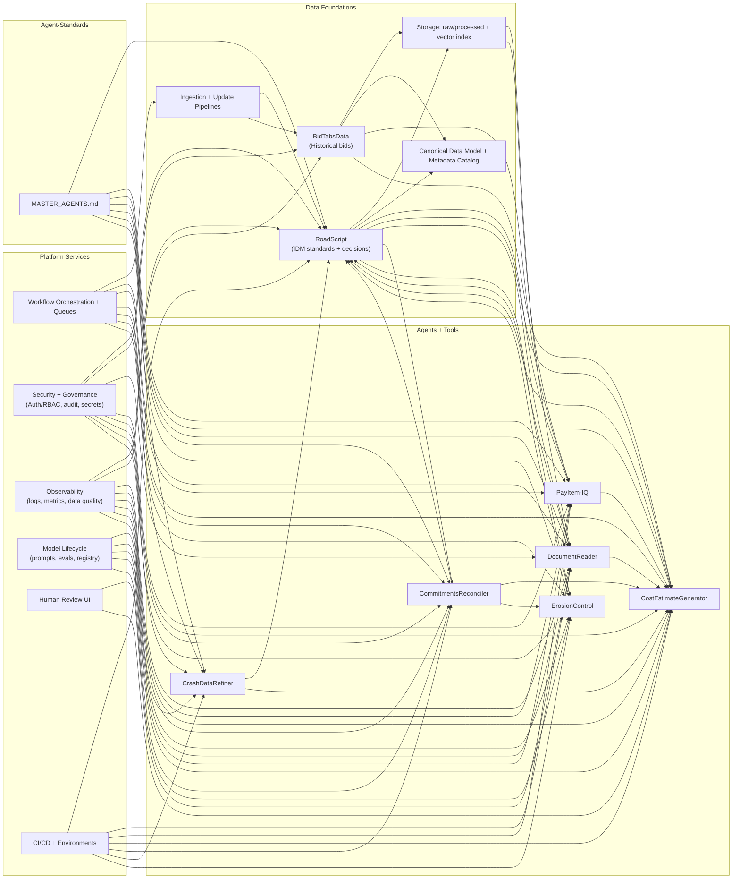

# RoadScript Ecosystem (Updated)

Updated diagram including the missing components and data flows.

```mermaid
flowchart LR
  subgraph Policy["Agent-Standards"]
    AGS["MASTER_AGENTS.md"]
  end

  subgraph Data["Data Foundations"]
    RS["RoadScript\n(IDM standards + decisions)"]
    BID["BidTabsData\n(Historical bids)"]
    ING["Ingestion + Update Pipelines"]
    CATALOG["Canonical Data Model + Metadata Catalog"]
    STORE["Storage: raw/processed + vector index"]
  end

  subgraph Agents["Agents + Tools"]
    PIQ["PayItem-IQ"]
    CEG["CostEstimateGenerator"]
    DR["DocumentReader"]
    CR["CommitmentsReconciler"]
    CDR["CrashDataRefiner"]
    EC["ErosionControl"]
  end

  subgraph Platform["Platform Services"]
    ORCH["Workflow Orchestration + Queues"]
    GOV["Security + Governance\n(Auth/RBAC, audit, secrets)"]
    OBS["Observability\n(logs, metrics, data quality)"]
    MLOPS["Model Lifecycle\n(prompts, evals, registry)"]
    HITL["Human Review UI"]
    CICD["CI/CD + Environments"]
  end

  AGS --> RS
  AGS --> PIQ
  AGS --> CEG
  AGS --> DR
  AGS --> CR
  AGS --> CDR
  AGS --> EC

  ING --> RS
  ING --> BID
  RS --> STORE
  BID --> STORE
  RS --> CATALOG
  BID --> CATALOG

  STORE --> DR
  STORE --> PIQ

  RS --> PIQ
  RS --> CEG
  RS --> DR
  RS --> CR
  RS --> EC

  BID --> PIQ
  BID --> CEG
  PIQ --> CEG

  DR --> RS
  DR --> CEG

  CR --> CEG
  CR --> EC

  CDR --> RS
  CDR --> CEG

  CEG --> RS
  CR --> RS
  EC --> RS

  ORCH --> ING
  ORCH --> DR
  ORCH --> PIQ
  ORCH --> CEG
  ORCH --> CR
  ORCH --> CDR
  ORCH --> EC

  GOV --> RS
  GOV --> BID
  GOV --> DR
  GOV --> PIQ
  GOV --> CEG
  GOV --> CR
  GOV --> CDR
  GOV --> EC

  OBS --> RS
  OBS --> BID
  OBS --> DR
  OBS --> PIQ
  OBS --> CEG
  OBS --> CR
  OBS --> CDR
  OBS --> EC

  MLOPS --> DR
  MLOPS --> PIQ
  MLOPS --> CEG
  MLOPS --> CR
  MLOPS --> EC

  HITL --> DR
  HITL --> CEG

  CICD --> RS
  CICD --> DR
  CICD --> PIQ
  CICD --> CEG
  CICD --> CR
  CICD --> CDR
  CICD --> EC
```
